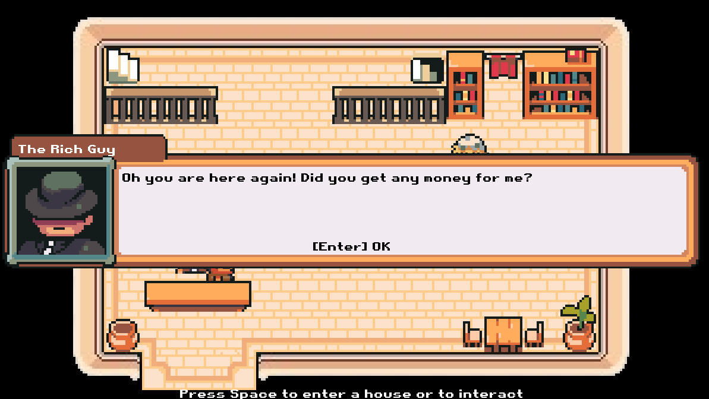
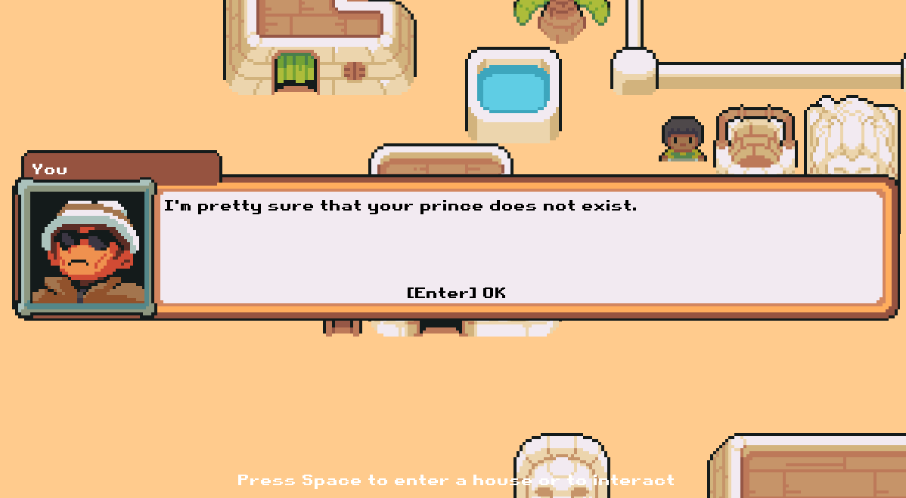
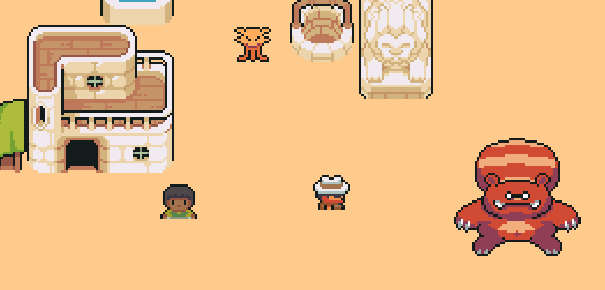

### Art Of War ist ein Videospiel, bei dem ich gerade arbeite.
### Es wurde von mir seit Dezember 2023 in Python mit Pygame programmiert. (Es ist noch nicht fertig) Man kann sich mit WASD bewegen und man kann mit der Leertaste mit NPCs interagieren oder in ein Gebäude eintreten.

### Ich habe dafür eine Programmiersprache entwickelt: I++. Das Verhalten der NPCs des Spieles wird in I++ programmiert, z. B. eine DialogBox zu öffnen, ist eine native Funktion der I++ Programmiersprache.
### In I++ wird eine Funktion so definiert:

proc test;param1;param2;param3

var a=param1

messagebox;"HALLO";"HALLO NEUE WELT, wir sind im Jahr ";(()unixtimeyear);" nach 1970.";MESSAGEBOX_OK
messagebox;"HALLO";"Mein erstes Argument ist:";a;MESSAGEBOX_OK

var b = 1 + 2

if b == 3 {
    printf;"HALLO WELT"
}
else {
    printf;"Du bist böse"
}

#Ein wert zurückgeben
ret a

endproc test

proc main

test;1;2;"Hallo"

endproc main

### Um das Spiel zu testen, müssen python 3, pygame, pytmx, pyscroll und requests installiert werden. Dann muss die Datei main.py im Ordner src geöffnet werden.
